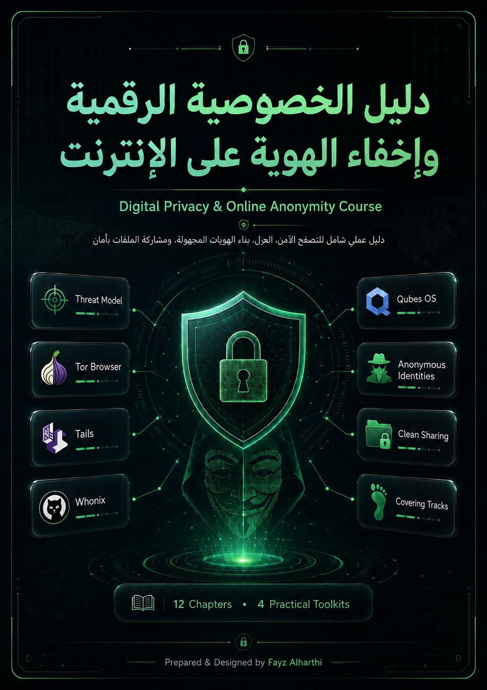

# Digital Privacy & Online Anonymity Course  
## دليل الخصوصية الرقمية وإخفاء الهوية على الإنترنت

<p align="center">
  
</p>

---

## Overview | نظرة عامة

This repository contains a complete Arabic guide in PDF format about **Digital Privacy, Online Anonymity, OPSEC, identity separation, anonymous browsing environments, secure communication, and safe file sharing**.

يحتوي هذا المستودع على دليل عربي شامل بصيغة PDF يشرح الخصوصية الرقمية وإخفاء الهوية على الإنترنت بأسلوب عملي ومنظم، بداية من فهم نموذج التهديد وطرق التتبع، مرورًا باستخدام أدوات مثل Tor Browser وTails وWhonix وQubes OS، وصولًا إلى إنشاء الهويات المجهولة، مشاركة الملفات بأمان، وإزالة الآثار الرقمية بعد الاستخدام.

---

## Download the Full Guide | تحميل الدليل الكامل

| File | Description | Link |
|---|---|---|
| Full PDF Guide | الدليل الكامل بصيغة PDF ويحتوي على جميع الفصول والحزم العملية | [Open PDF Guide](./Digital%20Privacy%20%26%20Online%20Anonymity%20Course.pdf) |

---

## Course Structure | هيكلة الدليل

The guide is organized into:

- **12 Chapters**
- **4 Practical Toolkits**
- **Professional Course Cover**
- **Arabic explanations with English technical terms where needed**

تم تنظيم الدليل ليكون مناسبًا للدراسة المتدرجة، بحيث يبدأ بالمفاهيم الأساسية ثم ينتقل إلى الأدوات العملية، وبعد كل ثلاثة فصول توجد حزمة عملية تساعد على تحويل الأفكار النظرية إلى خطوات قابلة للتطبيق.

---

## Chapters | الفصول

| Chapter | Title | Description |
|---|---|---|
| Chapter 1 | Introduction to Digital Privacy & Threat Modeling | مقدمة في الخصوصية الرقمية وبناء نموذج التهديد |
| Chapter 2 | Network Tracking & Online Exposure | تتبع الشبكات، عنوان IP، DNS، VPN، وTor basics |
| Chapter 3 | Device & Identity Leaks | تسريبات الجهاز والهوية مثل IMEI, IMSI, MAC, Bluetooth, Telemetry |
| Chapter 4 | Personal Data, OSINT & Social Engineering | البيانات الشخصية، Metadata، OSINT، الهندسة الاجتماعية، والقياسات الحيوية |
| Chapter 5 | Malware, Files & Cryptography Risks | مخاطر الملفات، البرمجيات الخبيثة، USB، النسخ السحابية، والتشفير الضعيف |
| Chapter 6 | General Preparations | التجهيزات العامة: كلمات المرور، رقم منفصل، USB، واختيار أماكن اتصال مناسبة |
| Chapter 7 | Tor Browser & Tails Route | استخدام Tor Browser وTails كمسارات عملية للتصفح والعزل المؤقت |
| Chapter 8 | The Whonix Route | العزل باستخدام Whonix Gateway وWhonix Workstation داخل بيئة افتراضية |
| Chapter 9 | The Qubes Route | استخدام Qubes OS والعزل بالتقسيم عبر Qubes مختلفة حسب مستوى الثقة |
| Chapter 10 | Creating Anonymous Online Identities | إنشاء الهويات المجهولة، البريد، الرقم، Captchas، البصمة، والسلوك |
| Chapter 11 | Communication, Sharing & Maintenance | التواصل، مشاركة الملفات، Redaction، النسخ الاحتياطي، والمزامنة |
| Chapter 12 | Covering Tracks, Wiping & Final Review | إزالة الآثار، فهم HDD/SSD، الحذف الآمن، ومحركات البحث |

---

## Practical Toolkits | الحزم العملية

The guide includes four practical toolkits. Each toolkit appears after a group of chapters to convert the theory into tools, checklists, and operational workflows.

| Toolkit | Covers | Focus |
|---|---|---|
| Practical Toolkit 1 | Chapters 1–3 | أدوات الخصوصية الأساسية، RFID blocking، اختبار التسريبات، وعزل الجهاز |
| Practical Toolkit 2 | Chapters 4–6 | تنظيف Metadata، فحص الملفات، الحماية من التصيد، وتجهيز البيئة |
| Practical Toolkit 3 | Chapters 7–9 | Tor, Tails, Whonix, Qubes OS, leak testing, VM isolation, routing checks |
| Practical Toolkit 4 | Chapters 10–12 | بناء الهوية، مشاركة الملفات، النسخ الاحتياطي، تقليل الآثار، وإغلاق الهوية |

---

## Main Topics Covered | أهم المواضيع

This guide covers the following areas:

- Threat Modeling
- Digital Privacy Basics
- IP Address Tracking
- DNS Leaks
- VPN Limitations
- Tor Browser
- Tails OS
- Whonix
- Qubes OS
- Browser Fingerprinting
- Device Fingerprinting
- Phone Number Risks
- Email Aliasing
- Anonymous Identity Creation
- Metadata & EXIF
- OSINT Risks
- Social Engineering
- Malware & File Safety
- Secure File Sharing
- Redaction Techniques
- Secure Backups
- Cloud Sync Risks
- HDD vs SSD Secure Wiping
- Covering Digital Tracks
- OPSEC Checklists

---

## Recommended Learning Path | طريقة الدراسة المقترحة

For best results, study the guide in order:

1. Start with **Chapters 1–3** to understand privacy foundations, tracking, and device leaks.
2. Apply **Practical Toolkit 1**.
3. Continue with **Chapters 4–6** to understand OSINT, files, malware, and preparation.
4. Apply **Practical Toolkit 2**.
5. Study **Chapters 7–9** to understand Tor Browser, Tails, Whonix, and Qubes OS.
6. Apply **Practical Toolkit 3**.
7. Finish with **Chapters 10–12** to understand anonymous identities, sharing, maintenance, backups, and cleanup.
8. Apply **Practical Toolkit 4** as the final operational checklist.

---

Credits :
Prepared & Designed by Fayz Alharthi

License :
This project is shared for educational purposes.
You may use it as a learning reference while preserving proper credit.

---

## Useful Links & Resources | روابط وأدوات مفيدة

This section contains the external links mentioned throughout the guide, organized by category.

---

## 1. RFID & Physical Privacy Tools

| Tool / Search | Purpose | Link |
|---|---|---|
| RFID Blocking Card | البحث عن بطاقات حجب RFID | https://www.amazon.com/s?k=RFID+blocking+card |
| RFID Blocking Wallet | البحث عن محافظ حجب RFID | https://www.amazon.com/s?k=RFID+blocking+wallet |
| Faraday Pouch for Phone | البحث عن حقائب عزل الهاتف | https://www.amazon.com/s?k=faraday+pouch+for+phone |

---

## 2. Privacy Operating Systems & Anonymous Browsing

| Tool | Purpose | Link |
|---|---|---|
| Tor Browser | متصفح للتصفح عبر شبكة Tor | https://www.torproject.org/download/ |
| Tor Check | التحقق من أن الاتصال يمر عبر Tor | https://check.torproject.org/ |
| Tails OS | نظام Live USB يركز على الخصوصية | https://tails.net/ |
| Tails Installation Guide | دليل تثبيت Tails الرسمي | https://tails.net/install/ |
| Whonix | بيئة عزل تعتمد على Gateway وWorkstation | https://www.whonix.org/ |
| Qubes OS | نظام عزل متقدم يعتمد على compartmentalization | https://www.qubes-os.org/ |

---

## 3. Leak Testing & Browser Fingerprinting

| Tool | Purpose | Link |
|---|---|---|
| WhatIsMyIP | فحص عنوان IP العام | https://www.whatismyip.com/ |
| DNS Leak Test | فحص تسريبات DNS | https://www.dnsleaktest.com/ |
| BrowserLeaks | فحص WebRTC, Canvas, Fonts, WebGL وغيرها | https://browserleaks.com/ |
| Cover Your Tracks - EFF | فحص بصمة المتصفح ومدى تميزها | https://coveryourtracks.eff.org/ |
| MXToolbox Blacklists | فحص سمعة IP أو النطاق في القوائم السوداء | https://mxtoolbox.com/blacklists.aspx |

---

## 4. Password Managers & Identity Separation

| Tool | Purpose | Link |
|---|---|---|
| KeePassXC | مدير كلمات مرور محلي ومفتوح المصدر | https://keepassxc.org/ |
| Bitwarden | مدير كلمات مرور سحابي أو ذاتي الاستضافة | https://bitwarden.com/ |
| SimpleLogin | إنشاء email aliases لفصل الهويات | https://simplelogin.io/ |
| addy.io | خدمة aliases للبريد الإلكتروني | https://addy.io/ |

---

## 5. Metadata Removal & File Cleaning

| Tool | Purpose | Link |
|---|---|---|
| ExifTool | فحص وإزالة Metadata من الصور والملفات | https://exiftool.org/ |
| MAT2 | Metadata Anonymisation Toolkit | https://0xacab.org/jvoisin/mat2 |
| VerExif | فحص وإزالة EXIF من الصور عبر الويب | https://www.verexif.com/en/ |

> ملاحظة: للملفات الحساسة، الأفضل استخدام أدوات محلية مثل ExifTool أو MAT2 بدل رفع الملف إلى خدمة ويب.

---

## 6. Phishing, URL & Domain Checking

| Tool | Purpose | Link |
|---|---|---|
| VirusTotal URL Scanner | فحص الروابط المشبوهة | https://www.virustotal.com/gui/home/url |
| URLScan.io | تحليل صفحة ورؤية الطلبات والنطاقات | https://urlscan.io/ |
| MXToolbox | فحص DNS, mail records, blacklists, domain reputation | https://mxtoolbox.com/ |
| Have I Been Pwned | فحص هل البريد ظهر في تسريبات | https://haveibeenpwned.com/ |
| Google Safe Browsing Transparency Report | فحص سمعة موقع | https://transparencyreport.google.com/safe-browsing/search |

---

## 7. Virtualization & Isolated Testing

| Tool | Purpose | Link |
|---|---|---|
| VirtualBox | تشغيل أنظمة وهمية لاختبار الملفات والبيئات | https://www.virtualbox.org/ |
| VMware Workstation Player | تشغيل أنظمة وهمية كبديل لـ VirtualBox | https://www.vmware.com/products/workstation-player.html |
| Hybrid Analysis | تحليل ملفات وسلوك Malware | https://www.hybrid-analysis.com/ |
| FileScan.IO | تحليل ملفات وروابط بشكل سلوكي | https://www.filescan.io/ |

> ملاحظة: لا ترفع ملفات شخصية أو حساسة إلى خدمات تحليل عامة؛ لأنها قد تحفظ أو تشارك العينات.

---

## 8. File Editing, Redaction & Media Cleaning

| Tool | Purpose | Link |
|---|---|---|
| GIMP | تحرير الصور وتنقيحها محليًا | https://www.gimp.org/ |
| Audacity | تحرير الصوت وإزالة المقاطع الحساسة | https://www.audacityteam.org/ |

---

## 9. File Sharing, Collaboration & Storage Platforms

| Platform | Purpose | Link |
|---|---|---|
| CryptPad | تعاون ومشاركة ملفات بتركيز على الخصوصية | https://cryptpad.fr/ |
| AnonArchive | مشاركة أو أرشفة ملفات بشكل عام | https://anonarchive.org/ |
| Filen | تخزين سحابي يركز على الخصوصية | https://filen.io/ |
| IPFS | نشر وتوزيع ملفات بطريقة لامركزية | https://ipfs.tech/ |
| Pinata | خدمة pinning لـ IPFS | https://www.pinata.cloud/ |

---

## 10. Summary by Use Case

| Use Case | Recommended Links |
|---|---|
| Anonymous Browsing | Tor Browser, Tor Check |
| Live Privacy OS | Tails OS, Tails Installation Guide |
| VM-based Anonymity | Whonix, VirtualBox |
| Advanced Compartmentalization | Qubes OS |
| Leak Testing | DNS Leak Test, BrowserLeaks, Cover Your Tracks, WhatIsMyIP |
| Password & Identity Separation | KeePassXC, Bitwarden, SimpleLogin, addy.io |
| Metadata Cleaning | ExifTool, MAT2, VerExif |
| Phishing & URL Analysis | VirusTotal, URLScan.io, Google Safe Browsing |
| Malware/File Analysis | Hybrid Analysis, FileScan.IO |
| Redaction & Editing | GIMP, Audacity |
| File Sharing & Storage | CryptPad, Filen, IPFS, Pinata |


---
## Repository Contents | محتويات المستودع

```text
digital-privacy-online-anonymity-course/
│
├── README.md
├── cover.png
└── Digital-Privacy-Online-Anonymity-Course.pdf
